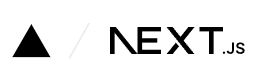
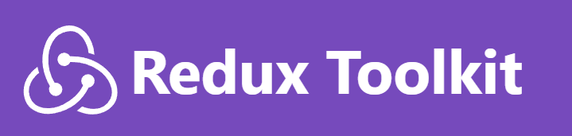
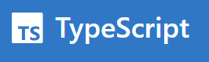
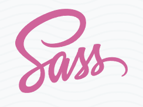

# NextJS Bootstrap

This is an opinionated stack, pulled together in my endless tinkering. Will likely use in production soon.

- NextJS

  

  Offers maximum control over content delivery (SSR, SSG, Client-Side, etc). Future-proof, fast, with tons of tooling.

- Redux Toolkit

  

  I love this project, but I prefer redux saga over thunk. Client-side state persisted with redux persist.

- Typescript

  

  Everything is strongly typed for maximum type hinting + minimal fuss.
  Even redux, actions, selectors, etc... It all comes for free.

- React-Redux (connect)

  

  I like to hoist data fetching concerns outside components.
  Components are cleaner, maintainable, re-usable, etc.

- SASS

  

  With modules, if desired. I love the way Sass makes me think!
  Maximum re-use = creativity and abstract thinking.

- Supabase with GrapQL

  

  Normalized data + GraphQL = endgame. Supabase makes this ridiculously easy.

#### Coming soon

- Redux Saga

  

  Tough to master, but without a doubt the cleanest + most powerful way to express async logic flows. Dialing into typescript might be challenging though... we shall see.

## Usage

```
npm install .
```

```
npm run start
```

## A Note from the Author

Thanks for your interest! Please see my [GitHub](https://github.com/ianhaggerty) or [Linkedin](https://www.linkedin.com/in/ihaggerty/) to stay updated.

## MIT License

Copyright (c) 2024 Ian Haggerty

Permission is hereby granted, free of charge, to any person obtaining a copy
of this software and associated documentation files (the "Software"), to deal
in the Software without restriction, including without limitation the rights
to use, copy, modify, merge, publish, distribute, sublicense, and/or sell
copies of the Software, and to permit persons to whom the Software is
furnished to do so, subject to the following conditions:

The above copyright notice and this permission notice shall be included in all
copies or substantial portions of the Software.

THE SOFTWARE IS PROVIDED "AS IS", WITHOUT WARRANTY OF ANY KIND, EXPRESS OR
IMPLIED, INCLUDING BUT NOT LIMITED TO THE WARRANTIES OF MERCHANTABILITY,
FITNESS FOR A PARTICULAR PURPOSE AND NONINFRINGEMENT. IN NO EVENT SHALL THE
AUTHORS OR COPYRIGHT HOLDERS BE LIABLE FOR ANY CLAIM, DAMAGES OR OTHER
LIABILITY, WHETHER IN AN ACTION OF CONTRACT, TORT OR OTHERWISE, ARISING FROM,
OUT OF OR IN CONNECTION WITH THE SOFTWARE OR THE USE OR OTHER DEALINGS IN THE
SOFTWARE.
